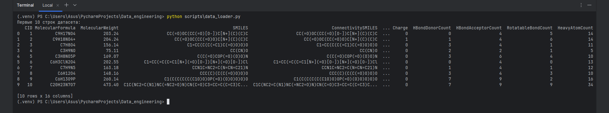

# Data_engineering
## Проект, посвященный изучению обработки данных

* Получение данных происходит с **PubChem** при помощи API. Для этого используется скрипт `collect.py`.
Скрипт запрашивает следующие данные: 

>"MolecularFormula", "MolecularWeight", "CanonicalSMILES",
    "IsomericSMILES", "InChIKey", "XLogP", "TPSA",
    "HBondDonorCount", "HBondAcceptorCount", "RotatableBondCount",
    "ExactMass", "MonoisotopicMass", "HeavyAtomCount",
    "Charge", "Complexity"

* Скрипт возращает около 2000 строк, которые затем преобразуются в csv файл. 

* "Сырой" файл расположен по [ссылке](https://drive.google.com/file/d/1ikuXF1TNjzX6-_GKWLaPh_9Jz0txgVDM/view?usp=drive_link).

Для работы с проектом необходимо создать виртуальное окружение на базе **pip**, а затем воспользоваться командой 

`pip install -r requirements.txt`

Скриншот с результатом команды `raw_data.head(10)`

